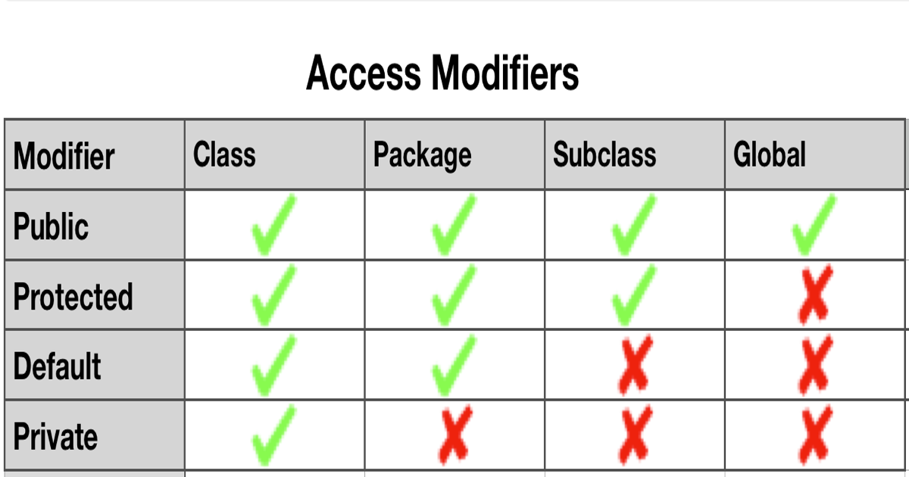

# Introduction

## Java fundamentals

### Visibility modifiers


[img reference](https://www.google.com/url?sa=i&url=https%3A%2F%2Fnonsookoroafor.medium.com%2Fmy-java-story-visibility-modifiers-4368b1919c68&psig=AOvVaw15TQUYRHRsAbMJvyMleDdL&ust=1703757489069000&source=images&cd=vfe&opi=89978449&ved=0CBMQjhxqFwoTCIC9i7Str4MDFQAAAAAdAAAAABAD)

### Constructors

``` java

public class Demo {
	private int x;
	private int y;

	public Demo(int x, int y) {
	this.x = x;
	this.y = y;
	}
}
```

- `this` is only necessary when the variable name is the same to specify instance variable

#### Constructor chaining

process of calling one constructor from another constructor with respect to current object

- done using `this()` keyword for constructors in the same class

``` java

public class Demo {
	private int x;
	private int y;

	public Demo(int a) {
	this = (a, 0); // does the setting manually by calling constructor2; equals to Demo(a, 0)
	}

	public Demo(int x, int y) { // constructor1
	this.x = x;
	this.y = y;
	}
}
```

## Value/Reference equality with primitive and Strings

### Reference equality

- check if two objects are the exact same object in memory
- `==`
- the address should be same to be `true`

### Value equality

- check if two objects are equal based on the user's specific use case and design
- `equals()`

### Primitives

- do not extend `Object`
- do not inherit `equals()`; must use `==` to check for equality
- no difference between value/reference equality

### Null checking

- use `==`
- `equals()` throws `NullPointerException` when called by null value

``` java
	String nullObject = null;
	String normal = "string";

	nullObject.equals(normal); // NullPointerException
	nullObject == null; // true
```

### String

`String s = "string";`
- creating String literal that is stored in a string pool for faster access
- no difference between value/reference equality; act similarly to primitives
- but extends Object, can use `equals()`

`String s = new String("string");`
- creating String as an object
- act like any other Object; allowing you to differentiate between value/reference equality

``` java
	String literal = "string";
	String anotherLiteral = "string";
	String object = new String("string");

	/*
	literal == object -> false
	literal == anotherLiteral -> false
	literal == "string" -> true
	object == "string" -> false
	object == new String("string") -> false
	"string" == "string" -> true
	
	using equals(), all the examples above will be true
	*/
```

### Wrapper

- each of the primitive types have a wrapper Object class
- generic typings implicitly require the type to inherit from the Object class
- Java has features like autoboxing/unboxing in order to streamline the experience

``` java
    Integer primitive = 1;
    Integer object = new Integer(1);
    
    /*
    primitive == object -> false
    primitive == 1 -> true
    object == 1 -> true
    object == new Integer(1) -> false
    
    using equals(), all the examples above will be true
    */
```

## Pass by Value/Reference

### Pass by value

``` java
public void view() {
	int i = 0;
	add(i); // i == 0
}
public void add(int x) {
	x = x + 1;
}
```

- takes in the value of what was passed in; not affect the original variable

### Pass by reference

- takes in the reference of what was passed in; affect the original variable

#### with primitives

``` java
public void view() {
	int i = 0;
	i = add(i); // i == 1
}
public void add(int x) {
	x = x + 1;
	return x;
}
```

#### with objects

``` java
public class Number {
	private int number;

	public Number(int number){
		this.number = number;
	}

	public int getNumber() {
		return number;
	}

	public void add(int amount) {
		number += amount;
	}

}

public class Demo {
	public void view() {
		Number num = new Number(0);
		add(num); // num.getNumber() == 1
		
	}
	public void add(Number x) {
		x.add(1);
	}
}
```

## Generics

parameterized types

- allow type to be a parameter of method, class, and interface

### Class

- defining generic class: `public class Name<T> {}`
- creating new object of generic class: `Name<type> name = new Name<type>();`

### Array

- `T[] arrayName = (T[]) new Object[length];`