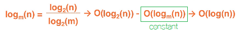

# Introduction 3

## Big-O

mathematical notation that describes the limiting behavior of a function

- an approach used to analyze the efficiency of algorithms and data structures
- belongs to a family of asymptotic notation

### Analyzing efficiency

1. measure both time and space efficiency
2. independent of hardware and software, platform environments
3. studied at a high level without implementation
    - focus on the basic operations to estimate the number of times they would be executed
4. performance scales in relation to the input sizes
    - as the input size increase, efficiency becomes obvious
5. complexity of an algorithm is how efficient the algorithm is in terms of input sizes
    - quantifying the time complexity of the algorithm as a function of the amount of input

### High level description

- analyze run time by defining a set of primitive operations in the code

#### Primitive operations

- assign value
- arithmetic operation
- comparing two entities
- calls to a method or a class
- returns from a method
- access element, or follow(create) a reference

#### Constant time

- each primitive operations are low-level instructions that will execute in very little time
    - therefore, we say execution is in constant time
- we count the number of these operations in an algorithm and how many times they execute
    - correlates to the run time of algorithm

### Measuring efficiency as a function

`f(n)`
-represents a function of primitive operations
- input size `n`

#### Considerations

1. Worst-Case
2. Best-Case
3. Average-Case

#### In Big-O

we want the most accurate Worst-Case analysis

### Big-O notation

`O(f(n))`

- typically represents an *upper bound*, worst-case
- there are other measures; o(n), θ(n), Ω(n) ...

#### f(n)

represents the algorithm scaled on the size of the input

## Big-O Conventions

### Drop constant factors

#### Example

`O(2n)` `O(n+1)` `O(1/3n)`
-> all of them should be `O(n)`

### Drop Lower Order Terms

`O(n^2 + 12312n)` should be `O(n^2)`

### Big-O examples

1. O(1): constant time complexity
    - performance does not scale at all with input size
2. O(n): linear complexity
3. O(log(n)): logarithmic complexity
    - base doesnt matter due to convention; 'Drop constant factors'
    - 
