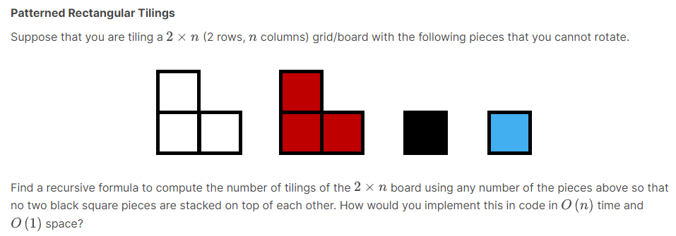
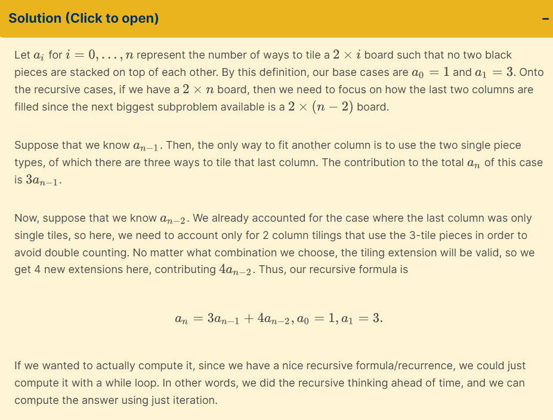
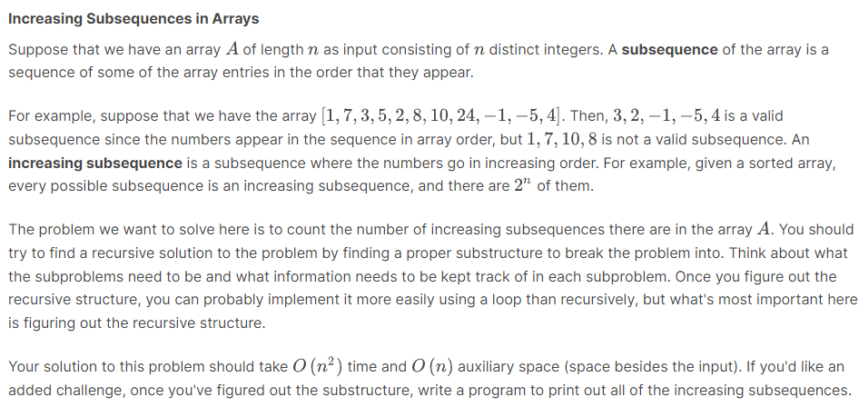
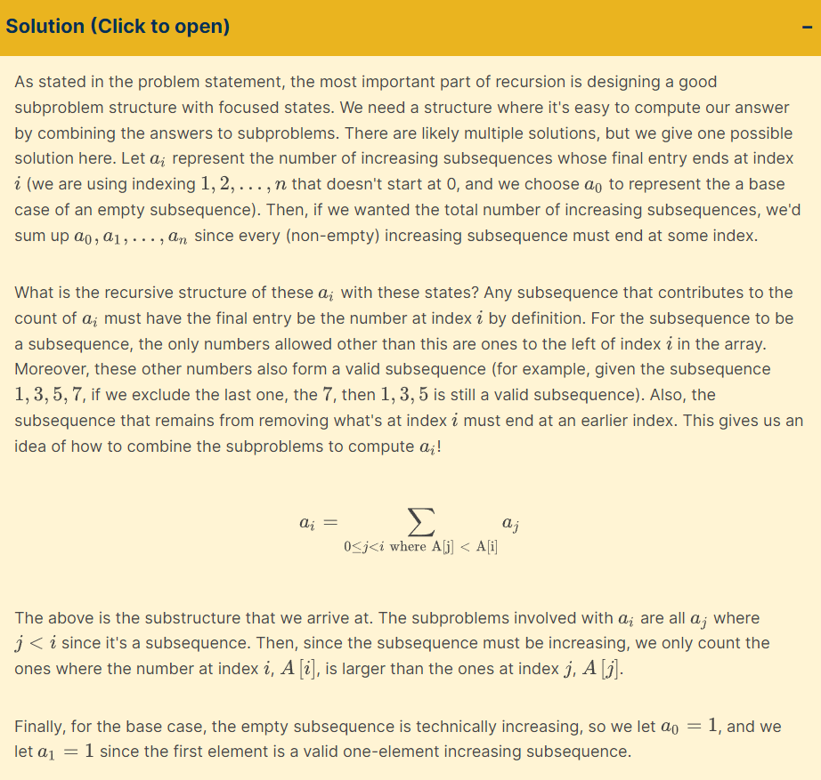
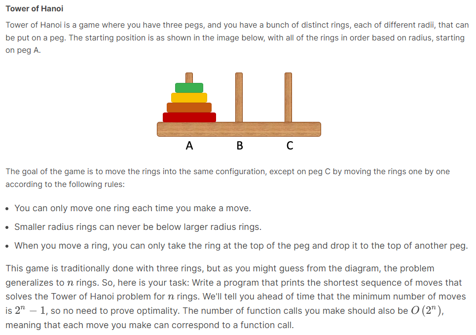
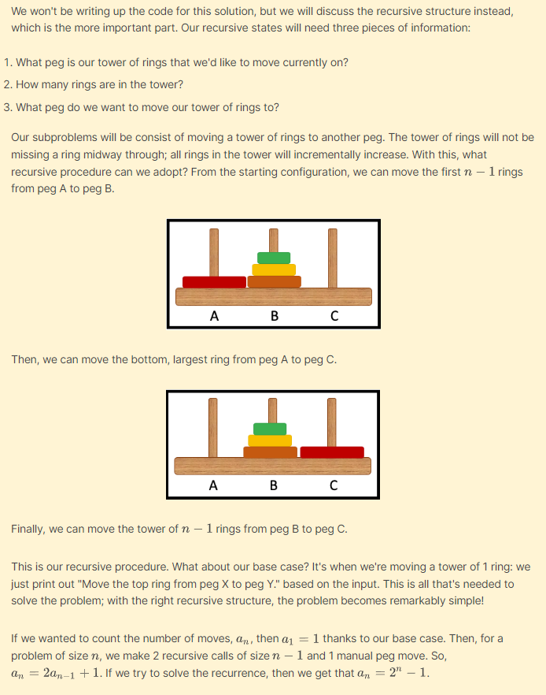

# Recursive

## Recursive method

a method is recursive if it repeated calls itself; 재귀

### Essential attributes

1. base case, terminating condition
    - base case can be multiple
2.  recursive case
    - method class to itself
3. progress to base case
    - have some parameter that advances towards termination
    - each recursive call must move towards the base case in some way

## Lab

### Patterned Rectangular Tilings



#### Code

```
    private final static String[][] TILE_WHITE = {{"white"}, {"white", "white"}};
    private final static String[][] TILE_RED = {{"red"}, {"red", "red"}};
    private final static String[][] TILE_BLACK = {{"black"}};
    private final static String[][] TILE_BLUE = {{"blue"}};

    public static List<List<String>> tiling(List<List<String>> tiles, int length){
        if (length < 1){
            return tiles;
        }
        if (length == 1){
            tiles.get(0).add(TILE_BLACK[0][0]);
            tiles.get(1).add(TILE_BLUE[0][0]);
            return tiles;
        }
        tiles.get(0).add(TILE_WHITE[0][0]);
        for (String tile : TILE_WHITE[1]){
            tiles.get(1).add(tile);
        }
        tiles.get(0).add(TILE_BLUE[0][0]);
        return tiling(tiles, length - 2);
```

#### Result

when length is even number

```
System.out.println(PatternedRectangularTilings.
    tiling(List.of(new ArrayList<>(), new ArrayList<>()), 10));

/* output:
[[white, blue, white, blue, white, blue, white, blue, white, blue],
[white, white, white, white, white, white, white, white, white, white]]
*/
```

when length is odd number
```
System.out.println(PatternedRectangularTilings.
    tiling(List.of(new ArrayList<>(), new ArrayList<>()), 7));

/* output:
[[white, blue, white, blue, white, blue, black],
[white, white, white, white, white, white, blue]]
*/
```

#### Solution



### Increasing Subsequences in Arrays



increasing subsequence란 주어진 배열에서 추출할 수 있는
1. index가 오름차순으로 배열됐고
2. value도 오름차순으로 배열된 subArray

예를 들어 [1,5,3,6] 이런 배열이 있으면
- [1], [5], [3], [6]
- [1,5] [1,3] [1,6] [3,6] [5,6]
- [1,5,6] [1,3,6]
이렇게 해당

#### 방법

- base case: 길이가 1일 때 이미 count한 목록에 없다면 return 1

1. 해당 배열이 오름차순으로 정렬되었는지 확인한다(인덱스 순서는 항상 유지되므로 무시)
    - 만약 그렇다면 순회한 배열 목록에 넣고 count++
2. 해당 배열의 subsequence 중 count한 목록에 없고 길이가 (해당배열 - 1)인 배열을 모두 재귀 호출해 값을 더한 후 return

#### Solution



### Tower Of Hanoi



#### 해결 방법

높이가 n인 링 더미를 옮기기 위해서는
1. 가장 밑에 있는 링을 제외하고 위의 링들을 모두 출발지도 도착지도 아닌 peg로 이동
    - 1 ~ n-1: 출발지 -> 잉여 peg
2. 1에서 가장 밑에 있던 링은 이제 출발지에 남은 유일한 링이므로 도착지로 바로 이동
    - n: 출발지 -> 도착지
3. 출발지도 도착지도 아닌 peg로 이동시켰던 링들을 다시 도착지로 이동
    - 1 ~ n-1: 잉여 peg -> 도착지

이 로직을 구현하는 함수를 f(높이, 출발지, 도착지, 잉여) 라고 할 때

- base case: 높이 = 1일 때
`도착지.push(출발지.pop())`

- 공식의 일반화
```
f(높이 - 1, 출발지, 잉여, 도착지)
도착지.push(출발지.pop())
f(높이 - 1, 잉여, 도착지, 출발지)
```
- 시간 복잡도: 2^n
```
함수를 간단하게 f(높이)라고 할 때
f(n)은 f(n-1), 이동 로직, f(n-1)을 수행한다
f(n-1)은 다시 f(n-2), 이동 로직, f(n-2)를 수행한다

즉 f(n)은 자신을 포함해 2^0 + 2^1 + ... + 2^(n-1)개의 함수를 호출하게 된다
각 함수마다 하는 일은 이동 로직 하나니까 수행하는 연산의 개수도 동일하다

2^0 + 2^1 + ... + 2^(n-1)은 등비수열의 합으로 계산할 수 있는데,
일반식이 a*r^(n-1)인 등비수열의 합은 a(r^n - 1)/(r - 1) 또는 a(1 - r^n)/(1 - r)이다
따라서 이 경우에는(2^n - 1)/(2 - 1) = 2^n - 1이다

빅 오 표기법에서 상수항, 상수 계수는 무시하므로 이 알고리즘의 결론적 시간 복잡도는 O(2^n)
```

#### Solution

