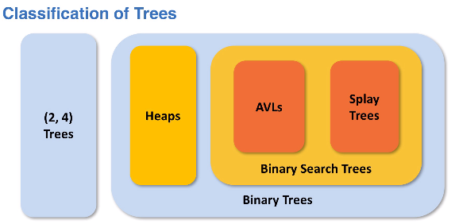

# BST Introduction

BST: Binary search tree

## Trees

linked structure where each node has a parent-child relationship

- connected, linked, non-linear, non-circular data structure
	- example: SLL

- classification



### Structure

- hierarchy is established between the nodes
- discuss nodes in terms of family relationship; parent, grandparent, siblings, cousins
- generally link between a child and parent is bidirectional

#### Terms

- shape: the structure of the nodes in the tree 
- order: the way data is arranged in the tree
- subtrees: one-element trees, empty null trees, etc.
- depth: refers to distance from the root
	- depth of root = 0
- height: refers to distance from the furthest leaf that can be reached from that node
	- height = maximum height or child + 1
	- height of leaf node = 0

#### Kind of nodes

- root node: node with no parent
- internal node: node with children
- external node = leaf node: node with no children

## Binary Trees

trees with shape restriction that each node can have at most two children

### Properties

- each node can have at most two children
- child nodes are labled left and right child
- left child always precedes the right in order of the nodes, not the data

- no order property for the data in a node imposed on binary tree

#### Node component

- data
- reference to parent
- references to child
	- leaf node points to actual data or null or dummy nodes

### Shapes

- full tree: every node except for the leaves has two children
- complete tree: all of the levels except bottom level are filled
	- bottom level of leaf nodes are filled with no gaps between those nodes
- degenerate tree: all nodes have one child except for the leaf

### Binary Search Tree

- inherit all properties from binary tree
- enforce a data order property where `left child data < parent data < right child data`
	- node's left subtree: all of the data is less than the data of node
	- node's right subtree: all of the data is greater than the data of node

- advantage: fewer nodes need to be traversed to find data
- compare: O(logN)

## Traversal

### Depth traversals

stack based

#### Preorder traversal

- useful when creating exact copy of original BST

```
def preorder(node):
	if node is not null:
		// record, print, some other task related to the data
		preorder(node.left)
		preorder(node.right)
	return
```

#### Postorder traversal

- uniquely identify BST

```
def preorder(node):
	if node is not null:
		postorder(node.left)
		postorder(node.right)
		// record, print, some other task related to the data
	return
```

#### Inorder traversal

- unique for BST: yield the data in a sorted order

```
def inorder(node):
	if node is not null:
		inorder(node.left)
		// record, print, some other task related to the data
		inorder(node.right)
	return
```

### Breadth traversals

queue based

#### Levelorder traversal

goal is to get list of all the data in the order that they appear in the levels or depths of the tree

```
def levelorder(node.root):
	queueu q
	q.enqueue(node.root)
	while q is not empty:
		current = q.dequeue()
		if current in not null:
			q.enqueue(current.left)
			q.enqueue(current.right)
```
