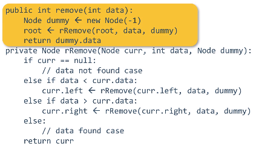
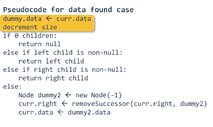
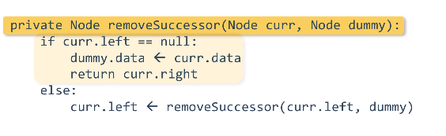
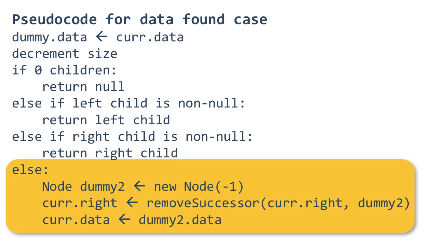
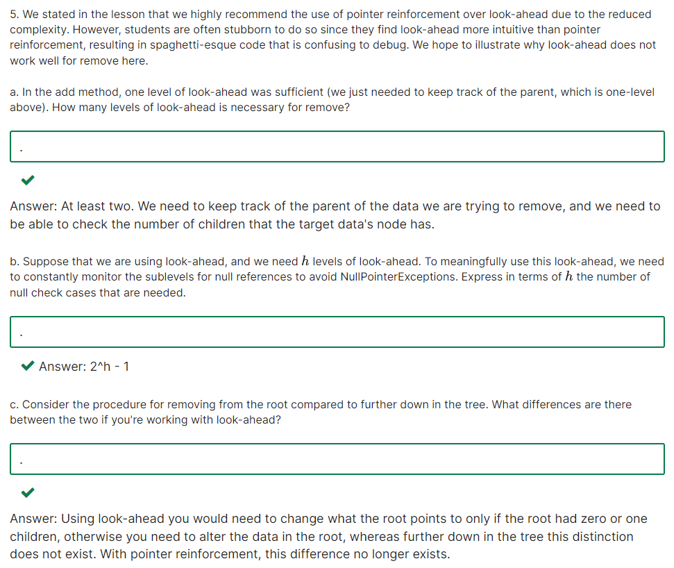
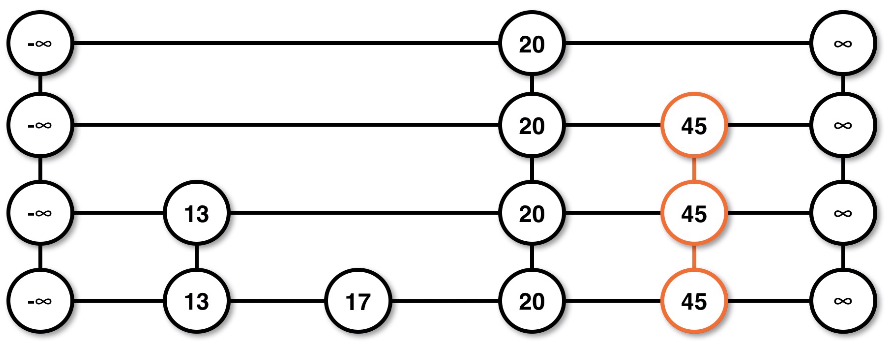
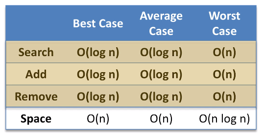
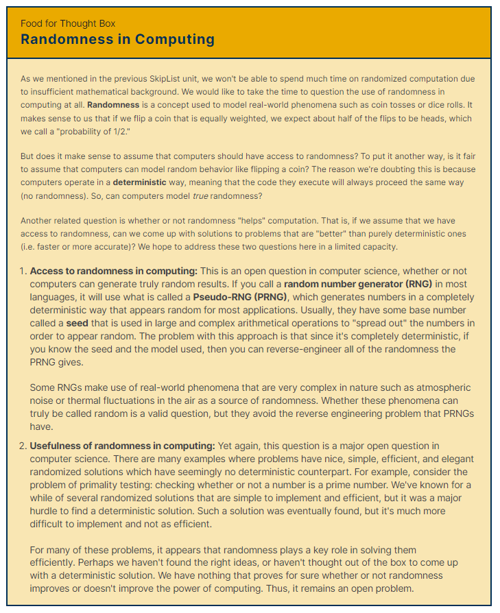

# Binary Search Tree Operation

## Searching

### Sequence

1. compare with root
2.
	- if target is greater, search right part of the root
	- if target is smaller, search left part of the root
3. repeat with the root of sub-tree until reaching null(under leaf node) or find the target data

#### Time complexity

- average: O(logN)
- worst: O(N)
	- in degenerate tree

## Adding

simillar to search

### Sequence

1. compare with root
2.
	- if target is greater, search right part of the root
	- if target is smaller, search left part of the root
3. repeat with the root of sub-tree
4.
	- if data of the node is equal to the data that guessed to be add, do not add
	- if reached to the null, add the data in that position

#### Time complexity

- average: O(logN)
- worst: O(N)
	- in degenerate tree

### Pointer reinforcement

- use return field to restructure tree
	- return field: the node that should be in the direction of traversal
- set left/right pointer to what is returned
- responsibility of restructuring is moved from the child's recursive call to the parent

#### Pseudo code

```
def add(current, data):
	if current == null:
		size++
		return node(data)
	elif data < current.data:
		current.left_child <- add(current.left_child, data)
	elif data > current.data:
		current.right_child <- add(current.right_child, data)
	return current
```

#### Look-ahead

- keep track of parent instead of current node
- never actually reaches a null node
	- check if child is null before traversing that direction
- add if child is null
- ineffective in complex operation

## Removing

### Sequence

1. compare with root
2.
	- if target is greater, search right part of the root
	- if target is smaller, search left part of the root
3. repeat until reaching the target
4. remove

- if reaching null node, exception

### Method to remove node

#### Zero child

set target node to null

#### One child

- make parent node of the target point child node of the target
- make child node of the target point parent node of the target

####Two children

change target node into predecessor/successor and remove predecessor/successor

- predecessor: largest element among the elements that is samll than target
- successor: smallest element among the elements that is larger than target

### Pseudo code

```
def remove(current, target):
	if current == null:
		throw exception
	elif current == target:
		predecessor = predecessor(target) // successor로도 가능
		target.data = predecessor.data
		predecessor = null
	elif current > target:
		remove(current.left, target)
	elif currnet < target:
		remove(current.right, target)


def predecessor(target):
	current = target.left
	while current.right != null:
		current = current.right
	return current


def successor(target):
	current = target.right
	while current.left != null:
		current = current.left
	return current
```

#### Using look-ahead








## SkipList

probability based data structure

### Structure


each level
- -무한대 = head, 무한대 = tail
- sorted in ascending order
- contain subset from the level below

- lowest level contain all data of skiplist

### Adding

#### Probability

promotion(appear) of node depends on coin flip

- `head` -> appear in one more level, promotes a node
- `tail` -> disappear in next level, terminates promotion in adding
- probability of node reaching level i, `P(i)` = (1/2)^i

#### Example




### Searching

the starting level dosen't matters

1. begin at the head = the top left infinity node
2. look at right node if it exists and compare with data
	- if `data < right`, continue moving right
	- if `data > right`, move to down level
	- if `data = right`, then data has been found
3. repeat until data to the right is either equal or no node
	- if at bottom level, data isn't in the skiplist

#### Remove

1. find the target data at the highest level
	- the first target data that is found is always at the highest level among the level that is promoted
2. remove target till the lowest level, level 0

### Time Complexity



### Purpose

1. simple concurrent access operation
	- concurrent access: scenario where you have two users/machines/agent working with the same data structure simultaneously
2. simple implement
3. introduction to randomization in computing

#### Randomness in computing

