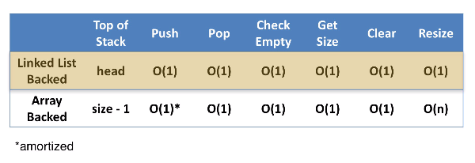

# Stack & Queue

## Linear ADT

### Linear

- finite collection of objects
- each object has one immediate predecessor
- each object has one immediate successor

#### Exeptions

1. first object with no predecessor
2. last object with no successor

### ADT

- data structure that is a container with a finite number of objects
- there is a relationship between the objects being stored
- defined by the operations or behavior of the operations
	- we omit or hide low level detail with a simpler high level idea
	- when this takes place, ADT is really defined by its behavior from the point of view of the user of the data

## Stack

linear ADT; LIFO

- can be implemented by array or linked list
- Last In First Out

### Operation

- push: add data at the top
- pop: remove data at the top
- peek(top/lastElement): return the element at the top, but not remove it
- isEmpty: check if the stack is empty
- clear: clear the stack

### Implementation

#### Linked List

- push: add data to head, set previous head to the head.next
- pop: set head.next to head
- clear: set head to null
- isEmpty: check if head is null

- no tail pointer
- stacks are lightweight
- singly-linked list is best

#### Array

- push: add data to the index == size
- pop: remove data of the index == size - 1
- clear: reset size variable to zero and
	1. leave the data and overwrite
		- garbage collect unable
		- bad idea for sensitive information
	2. reset each index in the array to null
		- inefficient; O(n)
	3. reassign the backing array to a new array
		- garbage collect able for the old data
- isEmpty: check if size is 0

## Queue

linear ADT; FIFO

- can be implemented by array or linked list
- First In First Out

### Operations

- enqueue: add data at the back
- dequeue: remove data at the front
- peek/top/fistElemnet: returns the data at the front but not remove it
- isEmpty
- clear

### Implementation

#### Linked list

with SLL with tail

- enqueue: add data at tail, using the tail pointer
- dequeue: set head.next to head
- peek/top/fistElemnet: returns the data at the head
- isEmpty: set head to null

#### Array

array backed

- arrays, not arrayList: avoid shifting altogether by adding or removing from the front
- have to know front index, back index(front+size), size, capacity
- wrap-around or circular array: allows data element to wrap-around the end of the array
	- if the index is over capacity, wrap around: mod the inremented back index by capacity
	- ex: `back %= capacity`

- enqueue: add data at the back
- dequeue: remove data at the front, front++(no shifting)
- peek/top/fistElemnet: returns the data at the front
- isEmpty: check size if it is 0
- clear: 위(stack)랑 동일

## Priority queues

linear ADT

### Specification

- remove: return element with highest priority
- example: emergency roon
- uses: retrieve minimum/maximum values from a data collection
- requirement: comparable

### Implementation

#### Ranking

- heaps

## Deques

linear ADT

- double ended queue
- not searchable; not FIFO or LIFO, cannot access to arbitrary elements
- just add and remove from front and back

### Operations

- addFirst
- addLast
- removeFirst
- removeLast
- isEmpty
- size

### Implementation

#### Array

- addFirst, removeLast: have to check if index < 0
	- if so, set the front or back marker equal to (capacity - 1)

#### DLL

can implement with DLL
